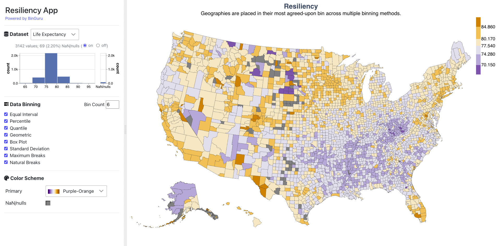

# Resiliency App
Resiliency is an ensemble technique that considers how frequently a geographic entity (e.g., county) falls in a particular bin across multiple comparable data binning methods.



## Setup
0. Open the command line/terminal on your machine and navigate to this project's top-level directory (i.e. where this file is).
1. Download and install node, npm from https://nodejs.org/en/download/. We developed and tested the app on {Node, NPM}: {v14.15.5, 6.14.11}. Optionally, use the <a href="https://github.com/nvm-sh/nvm" target="_blank">nvm (Node Version Manager)</a> to quickly install and use different versions of node via the command line.
2. `npm install -g @angular/cli@13.1.1` to install the desired angular-cli used to run ng-* commands.
3. `npm install` - installs required libraries from package.json. 


## Run
4. `ng serve` - compile and serve the application locally
5. Open the browser at http://localhost:4200
6. Enjoy!


## Build and Deployment
7. `ng build --configuration production --build-optimizer` - build the app and push the output into [angular.json](angular.json) > `outputPath` directory (default value = ["dist/"](dist/)).

8. `ng build --configuration production --build-optimizer --baseHref=/resiliency-app/` - build the app for deploying at a public URL with /resiliency-app/ base prefix.


## Credits
Resiliency was created by
<a target="_blank" href="http://narechania.com">Arpit Narechania</a>, <a href="https://va.gatech.edu/endert/">Alex Endert</a>, and <a href="https://friendlycities.gatech.edu/">Clio Andris</a> of the <a target="_blank" href="https://vis.gatech.edu/">Georgia Tech Visualization Lab.</a> We thank the members of the <a target="_blank" href="http://vis.gatech.edu/">Georgia Tech Visualization Lab</a> for their support and constructive feedback.</p>


## Citations
```bibTeX
@InProceedings{narechania2023resiliency,
  author =	{Narechania, Arpit and Endert, Alex and Andris, Clio},
  title =	{{Resiliency: A Consensus Data Binning Method}},
  booktitle =	{12th International Conference on Geographic Information Science (GIScience 2023)},
  pages =	{55:1--55:7},
  series =	{Leibniz International Proceedings in Informatics (LIPIcs)},
  year =	{2023},
  volume =	{277},
  publisher =	{Schloss Dagstuhl -- Leibniz-Zentrum f{\"u}r Informatik},
  doi =		{10.4230/LIPIcs.GIScience.2023.55}
}
```

## License
The software is available under the [MIT License](https://github.com/arpitnarechania/resiliency-app/blob/master/LICENSE).


## Contact
If you have any questions, feel free to [open an issue](https://github.com/arpitnarechania/resiliency-app/issues/new/choose) or contact [Arpit Narechania](http://narechania.com).